[TOC]

# 1 vue-cli 安装模板
```
➜  vue-el-dashboard git:(master) vue init webpack

? Generate project in current directory? Yes
? Project name vue-el-dashboard
? Project description A Vue.js project
? Author wangdd <wangdd@welljoint.com>
? Vue build standalone
? Install vue-router? Yes
? Use ESLint to lint your code? Yes
? Pick an ESLint preset Standard
? Setup unit tests No
? Setup e2e tests with Nightwatch? No

   vue-cli · Generated "vue-el-dashboard".

   To get started:

     npm install
     npm run dev

   Documentation can be found at https://vuejs-templates.github.io/webpack
```

# 2 安装依赖并运行
```
➜  vue-el-dashboard git:(master) ✗ cnpm i
✔ Installed 44 packages
✔ Linked 680 latest versions
➜ npm run dev
```
`浏览器打开如下页面`:

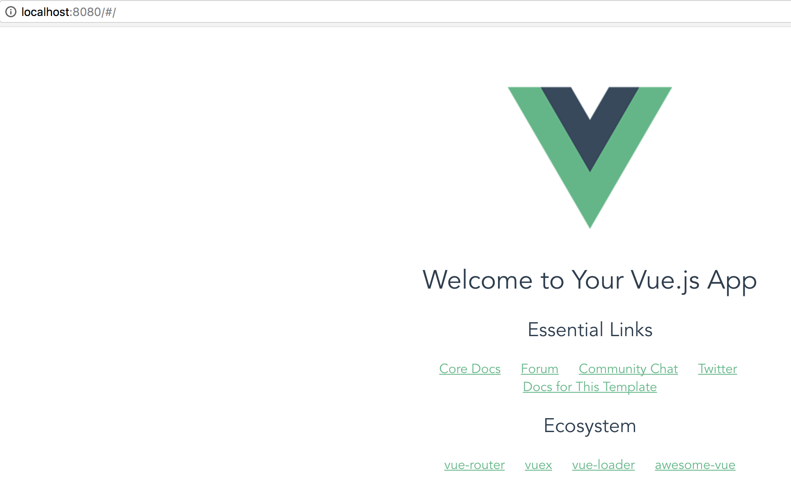

# 3 安装初始化页面布局
安装并使用Element UI

```
cnpm i element-ui -S
```

修改 /src/main.js 为：
```
import Vue from 'vue'
import ElementUI from 'element-ui'
import 'element-ui/lib/theme-chalk/index.css'

import App from './App'

Vue.config.productionTip = false

Vue.use(ElementUI)

/* eslint-disable no-new */
new Vue({
  el: '#app',
  template: '<App/>',
  components: { App }
})

```

我需要的布局是这种：
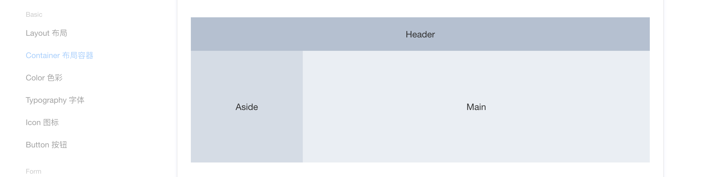

在 [Element](http://element-cn.eleme.io/#/zh-CN/component/container) 上复制对应的代码,
并粘贴到 /src/App.vue文件中：
```
<template>
  <div id="app">

    <el-container>
      <el-header>Header</el-header>
      <el-container>
        <el-aside width="200px">Aside</el-aside>
        <el-main>Main</el-main>
      </el-container>
    </el-container>

  </div>
</template>

<script>

export default {
  name: 'app'
}

</script>

<style>

</style>
```

不出意外的话，你可以在浏览器上看到如下布局：
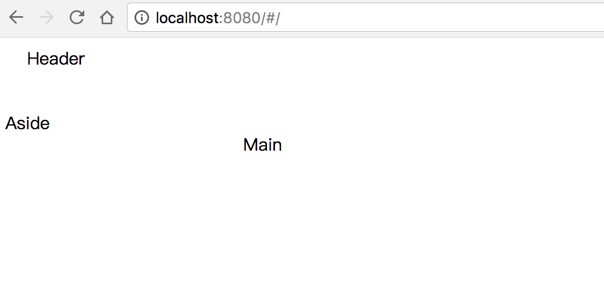

现在，布局就这么成了。

# 4 安装侧边菜单栏
我需要侧边栏是下图右边的自定义颜色的那种菜单
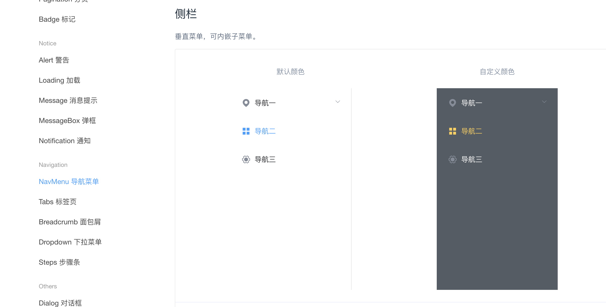

在components文件夹下新建NavMenu.vue
```
<template>
  <el-row class="tac">
    <el-col :span="12">
      <h5>默认颜色</h5>
      <el-menu default-active="2" class="el-menu-vertical-demo" @open="handleOpen" @close="handleClose">
        <el-submenu index="1">
          <template slot="title">
            <i class="el-icon-location"></i>
            <span>导航一</span>
          </template>
          <el-menu-item-group>
            <template slot="title">分组一</template>
            <el-menu-item index="1-1">选项1</el-menu-item>
            <el-menu-item index="1-2">选项2</el-menu-item>
          </el-menu-item-group>
          <el-menu-item-group title="分组2">
            <el-menu-item index="1-3">选项3</el-menu-item>
          </el-menu-item-group>
          <el-submenu index="1-4">
            <template slot="title">选项4</template>
            <el-menu-item index="1-4-1">选项1</el-menu-item>
          </el-submenu>
        </el-submenu>
        <el-menu-item index="2">
          <i class="el-icon-menu"></i>
          <span slot="title">导航二</span>
        </el-menu-item>
        <el-menu-item index="3">
          <i class="el-icon-setting"></i>
          <span slot="title">导航三</span>
        </el-menu-item>
      </el-menu>
    </el-col>
    <el-col :span="12">
      <h5>自定义颜色</h5>
      <el-menu default-active="2" class="el-menu-vertical-demo" @open="handleOpen" @close="handleClose" background-color="#545c64" text-color="#fff" active-text-color="#ffd04b">
        <el-submenu index="1">
          <template slot="title">
            <i class="el-icon-location"></i>
            <span>导航一</span>
          </template>
          <el-menu-item-group>
            <template slot="title">分组一</template>
            <el-menu-item index="1-1">选项1</el-menu-item>
            <el-menu-item index="1-2">选项2</el-menu-item>
          </el-menu-item-group>
          <el-menu-item-group title="分组2">
            <el-menu-item index="1-3">选项3</el-menu-item>
          </el-menu-item-group>
          <el-submenu index="1-4">
            <template slot="title">选项4</template>
            <el-menu-item index="1-4-1">选项1</el-menu-item>
          </el-submenu>
        </el-submenu>
        <el-menu-item index="2">
          <i class="el-icon-menu"></i>
          <span slot="title">导航二</span>
        </el-menu-item>
        <el-menu-item index="3">
          <i class="el-icon-setting"></i>
          <span slot="title">导航三</span>
        </el-menu-item>
      </el-menu>
    </el-col>
  </el-row>
</template>

<script>
  export default {
    methods: {
      handleOpen(key, keyPath) {
        console.log(key, keyPath);
      },
      handleClose(key, keyPath) {
        console.log(key, keyPath);
      }
    }
  }
</script>
```

然后将NavMenu组件导入到App.vue中, 修改App.vue：
```
<template>
  <div id="app">

    <el-container>
      <el-header>Header</el-header>
      <el-container>
        <el-aside width="200px">
          <navmenu></navmenu>
        </el-aside>
        <el-main>Main</el-main>
      </el-container>
    </el-container>

  </div>
</template>

<script>
import NavMenu from '@/components/NavMenu'

export default {
  name: 'app',
  components: {
    'navmenu': NavMenu
  }
}

</script>

<style>

</style>

```

这里要解释一下这条语句, 该语句中的`@`, 符号是什么意思？
```
import NavMenu from '@/components/NavMenu'
```

在build/webpack.base.conf.js中有如下代码, alias就是起别名，`@符号就是代表src路径， 所以@/components/NavMenu就是src/components/NavMenu`。 这样webpack就知道如何引入文件了。这样做的好处是不必到处去写`src`了。
```
  resolve: {
    extensions: ['.js', '.vue', '.json'],
    alias: {
      'vue$': 'vue/dist/vue.esm.js',
      '@': resolve('src'),
    }
  },
```

现在打开浏览器，应该可以看到如下界面：
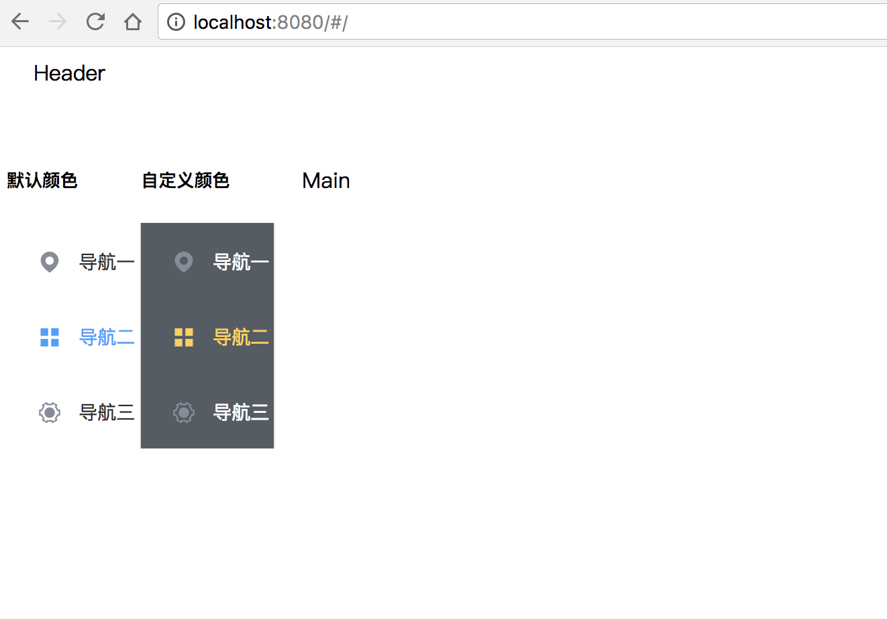

可以看到菜单已经引入进来了，但是是两个菜单，下面我们需要修改一下，只要右边的菜单，并删除一些多余的元素。
修改NavMenu.vue文件。
```
<template>
  <el-row class="tac">
    <el-col :span="24">
      <el-menu default-active="2" class="el-menu-vertical-demo" @open="handleOpen" @close="handleClose"
      unique-opened
      router
      background-color="#545c64" text-color="#fff" active-text-color="#ffd04b">
        <el-submenu index="1">
          <template slot="title">
            <i class="el-icon-location"></i>
            <span>导航一</span>
          </template>
          <el-menu-item-group>
            <el-menu-item index="1-1">选项1</el-menu-item>
            <el-menu-item index="1-2">选项2</el-menu-item>
            <el-menu-item index="1-3">选项3</el-menu-item>
            <el-menu-item index="1-4">选项4</el-menu-item>
          </el-menu-item-group>
        </el-submenu>

        <el-submenu index="2">
          <template slot="title">
            <i class="el-icon-location"></i>
            <span>导航二</span>
          </template>
          <el-menu-item-group>
            <el-menu-item index="2-1">选项1</el-menu-item>
            <el-menu-item index="2-2">选项2</el-menu-item>
            <el-menu-item index="2-3">选项3</el-menu-item>
            <el-menu-item index="2-4">选项4</el-menu-item>
          </el-menu-item-group>
        </el-submenu>

      </el-menu>
    </el-col>
  </el-row>
</template>

<script>
  export default {
    methods: {
      handleOpen(key, keyPath) {
        console.log(key, keyPath)
      },
      handleClose(key, keyPath) {
        console.log(key, keyPath)
      }
    }
  }
</script>
```

现在打开浏览器看看：
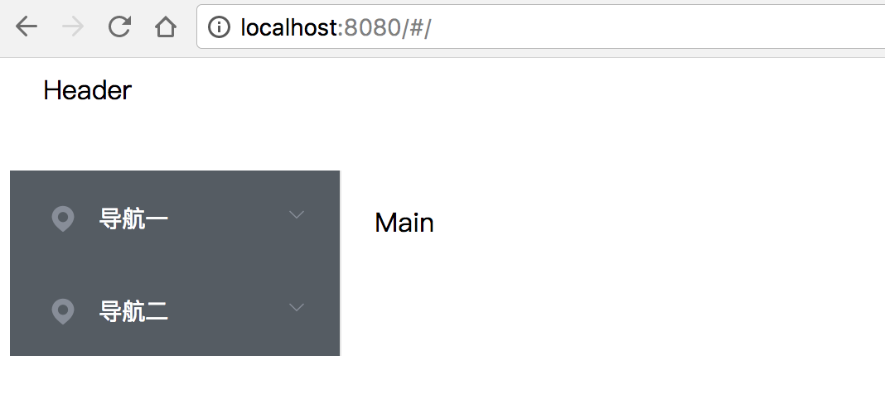

点击展开菜单看看：
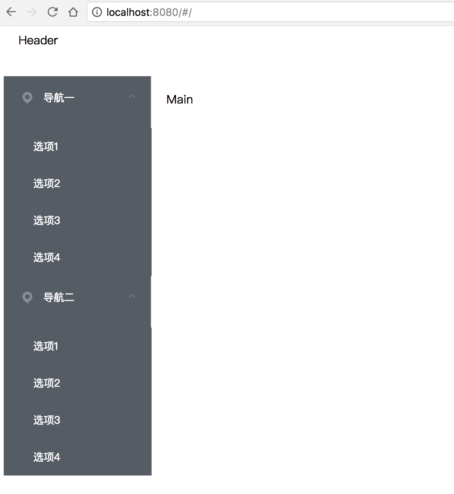

# 5 侧边菜单栏进阶

我们需要的功能：

1. 每次只能展开一个一级菜单
2. 每次点击一个二级菜单可以自动改变路由，跳转到对应的组件
3. 由于菜单在路由中也会使用，所以最好抽象出来，做成一个配置文件

第1点和第二点比较好搞，Element上已经有配置文档:

- unique-opened: 是否只保持一个子菜单的展开
- router: 是否使用 vue-router 的模式，启用该模式会在激活导航时以 index 作为 path 进行路由跳转

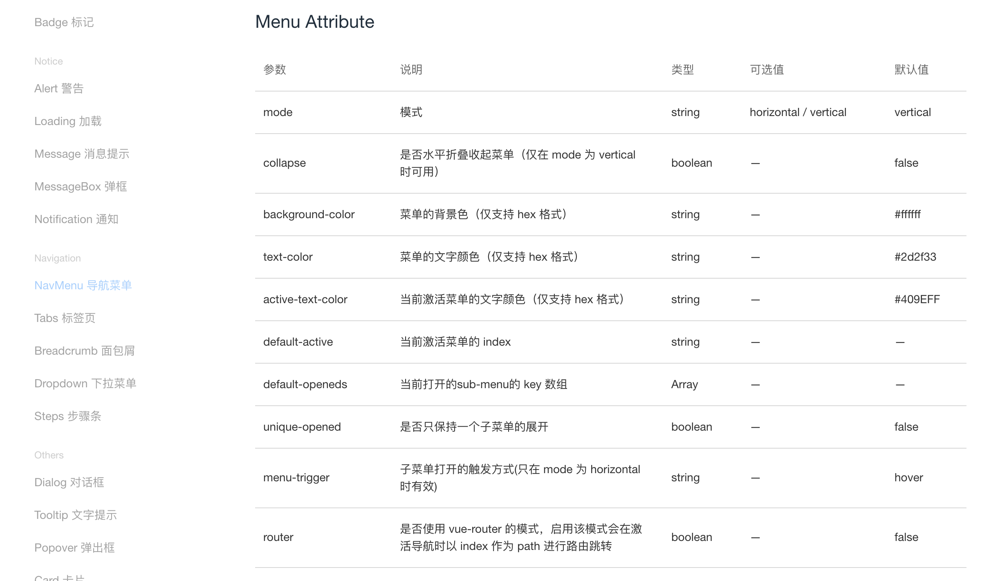

修改NavMenu.vue
```
<template>
  <el-row class="tac">
    <el-col :span="24">
      <el-menu default-active="2" class="el-menu-vertical-demo" @open="handleOpen" @close="handleClose"
      unique-opened
      router
      background-color="#545c64" text-color="#fff" active-text-color="#ffd04b">
        <el-submenu index="1">
          <template slot="title">
            <i class="el-icon-location"></i>
            <span>导航一</span>
          </template>
          <el-menu-item-group>
            <el-menu-item index="1-1">选项1</el-menu-item>
            <el-menu-item index="1-2">选项2</el-menu-item>
            <el-menu-item index="1-3">选项3</el-menu-item>
            <el-menu-item index="1-4">选项4</el-menu-item>
          </el-menu-item-group>
        </el-submenu>

        <el-submenu index="2">
          <template slot="title">
            <i class="el-icon-location"></i>
            <span>导航二</span>
          </template>
          <el-menu-item-group>
            <el-menu-item index="2-1">选项1</el-menu-item>
            <el-menu-item index="2-2">选项2</el-menu-item>
            <el-menu-item index="2-3">选项3</el-menu-item>
            <el-menu-item index="2-4">选项4</el-menu-item>
          </el-menu-item-group>
        </el-submenu>

      </el-menu>
    </el-col>
  </el-row>
</template>

<script>
  export default {
    methods: {
      handleOpen (key, keyPath) {
        console.log(key, keyPath)
      },
      handleClose (key, keyPath) {
        console.log(key, keyPath)
      }
    }
  }
</script>
```

打开浏览器，点击一个二级菜单看看，你会发现，效果并不像预期那样，而且控制台还向你扔出一个bug：
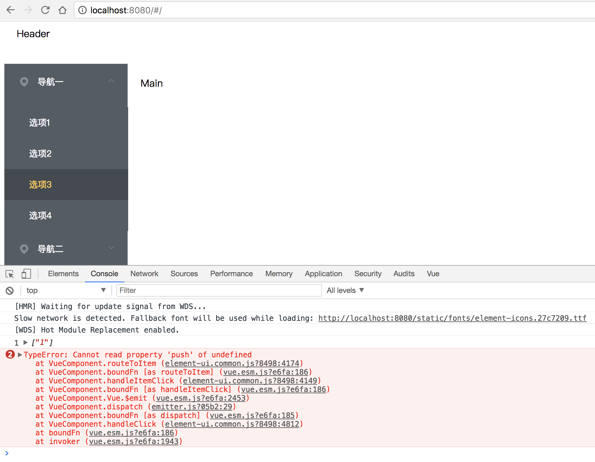

添加一个暂时的路由: 修改main.js
```
import Vue from 'vue'
import ElementUI from 'element-ui'
import 'element-ui/lib/theme-chalk/index.css'

import App from './App'
import router from './router'

Vue.config.productionTip = false

Vue.use(ElementUI)

/* eslint-disable no-new */
new Vue({
  el: '#app',
  router,
  template: '<App/>',
  components: { App }
})
```

打开浏览器，点击一个二级菜单，这时候没有报错，浏览器的路径也变了, 变成`http://localhost:8080/#/1-3`


`每次增加一个菜单都要写点html是不能忍的，能用js的，就别用html`。

在src目录下创建一个config目录，目录下创建一个menu-config.js 文件：
外层的数组代表一级菜单，内层sub数组代表二级菜单。

```
module.exports = [{
  name: '基础',
  id: 'basic',
  sub: [{
    name: 'Layout 布局',
    componentName: 'BasicLayout'
  }, {
    name: 'Container 布局容器',
    componentName: 'BasicContainer'
  }]
}, {
  name: 'Form',
  id: 'form',
  sub: [{
    name: 'Radio 单选框',
    componentName: 'FormRadio'
  }, {
    name: 'Checkbox 多选框',
    componentName: 'FormCheckbox'
  }]
}]

```

在NavMenu.vue中引入这个文件，并使用`v-for`循环去渲染这个菜单：
```
<template>
  <el-row class="tac">
  <el-col :span="24">
    <el-menu
      class="el-menu-vertical-demo"
      router
      unique-opened
      @open="handleOpen"
      @close="handleClose"
      background-color="#545c64"
      text-color="#fff"
      active-text-color="#ffd04b">

      <el-submenu v-for="item in menu" :index="item.id" :key="item.id">
        <template slot="title">
          <span v-text="item.name"></span>
        </template>
        <el-menu-item-group class="over-hide" v-for="sub in item.sub" :key="sub.componentName">
          <el-menu-item :index="sub.componentName" v-text="sub.name">
          </el-menu-item>
        </el-menu-item-group>
      </el-submenu>

    </el-menu>
  </el-col>
</el-row>
</template>

<style scoped>
  .over-hide{
    overflow: hidden;
  }
</style>

<script>
  import menu from '@/config/menu-config'

  export default {
    data () {
      return {
        menu: menu
      }
    },
    methods: {
      handleOpen (key, keyPath) {
        console.log(key, keyPath)
      },
      handleClose (key, keyPath) {
        console.log(key, keyPath)
      }
    }
  }
</script>
```

这里要说明一下，我给二级菜单加上了`over-hide`类，二级菜单在展开时，有点溢出父元素了。
打开浏览器看看, 这时候菜单已经是根据配置文件渲染的了。

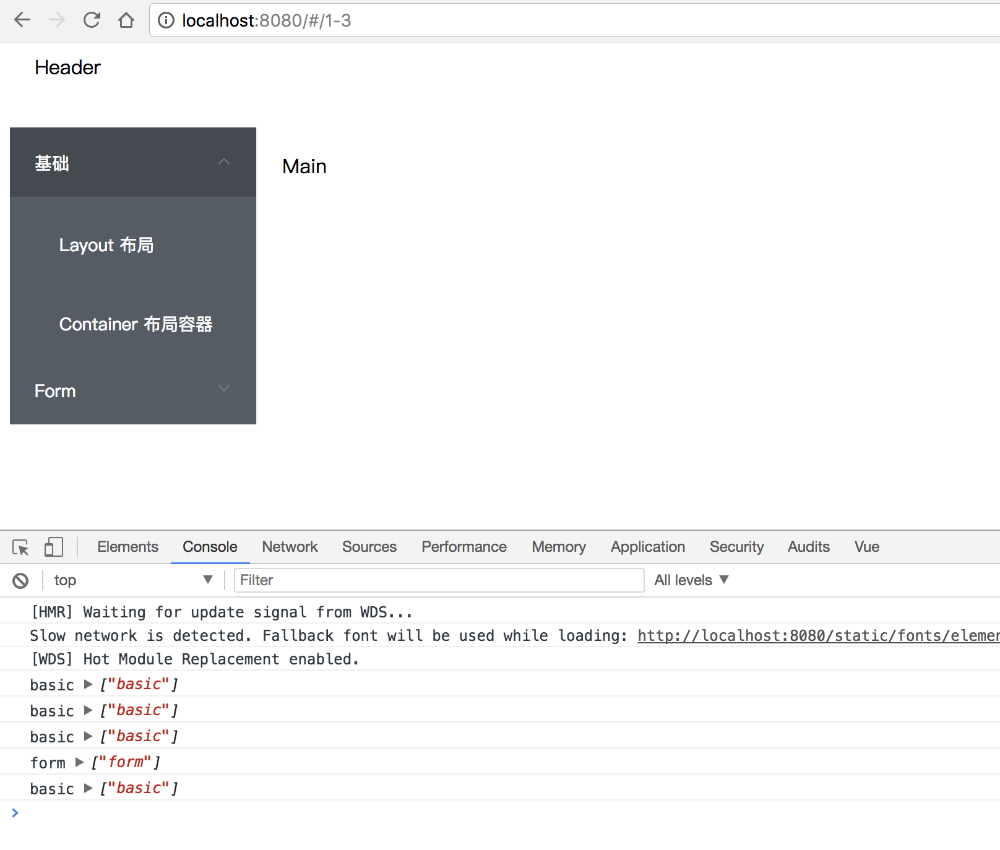

# 6 先加个头部吧，秃顶太丑了
在componets文件夹下创建一个Header.vue, 并在App.vue中引入，

Header.vue
```
<template>
  <el-row>
    <el-col :span="24"
      <div class="head-wrap">Element</div>
    </el-col>
  </el-row>
</template>

<style scoped>
.head-wrap{

}
</style>
```

App.vue
```
<template>
  <div id="app">
    <el-container>
      <el-header class="header">
        <vheader />
      </el-header>
      <el-container>
        <el-aside width="200px">
          <navmenu></navmenu>
        </el-aside>
        <el-main>Main
        </el-main>
      </el-container>
    </el-container>
  </div>
</template>
<script>
import NavMenu from '@/components/NavMenu'
import Header from '@/components/Header'

export default {
  name: 'app',
  components: {
    'navmenu': NavMenu,
    'vheader': Header
  }
}

</script>

<style>
.header {
  background-color: #409EFF;
  color: #fff;
  line-height: 60px;
}
</style>
```
这时候打开浏览器看看, 是不是已经好看一点了。但是body有边框，不好看啊！
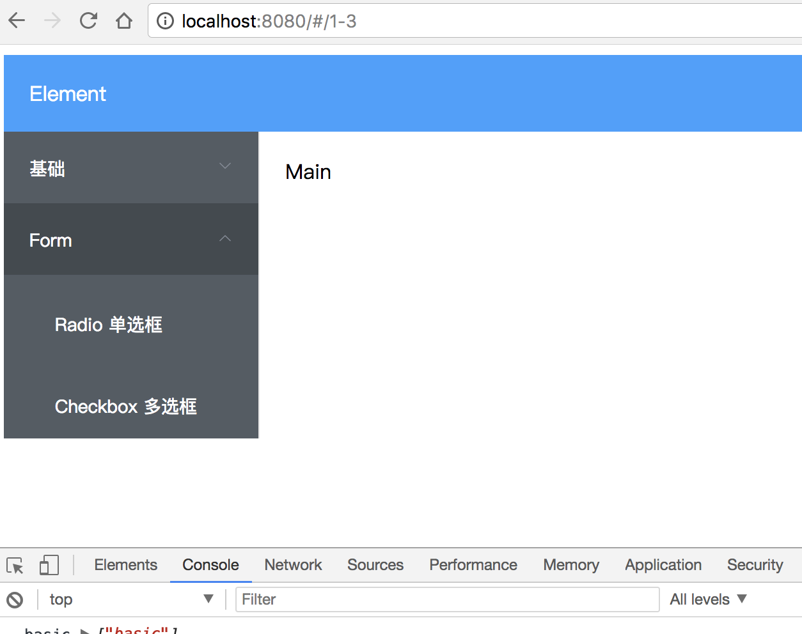

`再次美化`

- 使用css reset [Normalize.css](http://necolas.github.io/normalize.css/)
- 使用font-awesome [vue-awesome图标库](https://github.com/Justineo/vue-awesome)

`安装Normalize.css, vue-awesome`

```
cnpm i normalize.css -D
cnpm i vue-awesome -D
```

这里主要贴一下main.js的改动，其他的代码就不贴了：

```
import Vue from 'vue'
import ElementUI from 'element-ui'
import 'element-ui/lib/theme-chalk/index.css'
import NormailizeCss from 'normalize.css'
import 'vue-awesome/icons'
import Icon from 'vue-awesome/components/Icon'

import App from './App'
import router from './router'

Vue.config.productionTip = false

Vue.use(ElementUI)
Vue.component('icon', Icon)

/* eslint-disable no-new */
new Vue({
  el: '#app',
  router,
  template: '<App/>',
  components: { App }
})
```
看下效果, 图标什么的都有了。
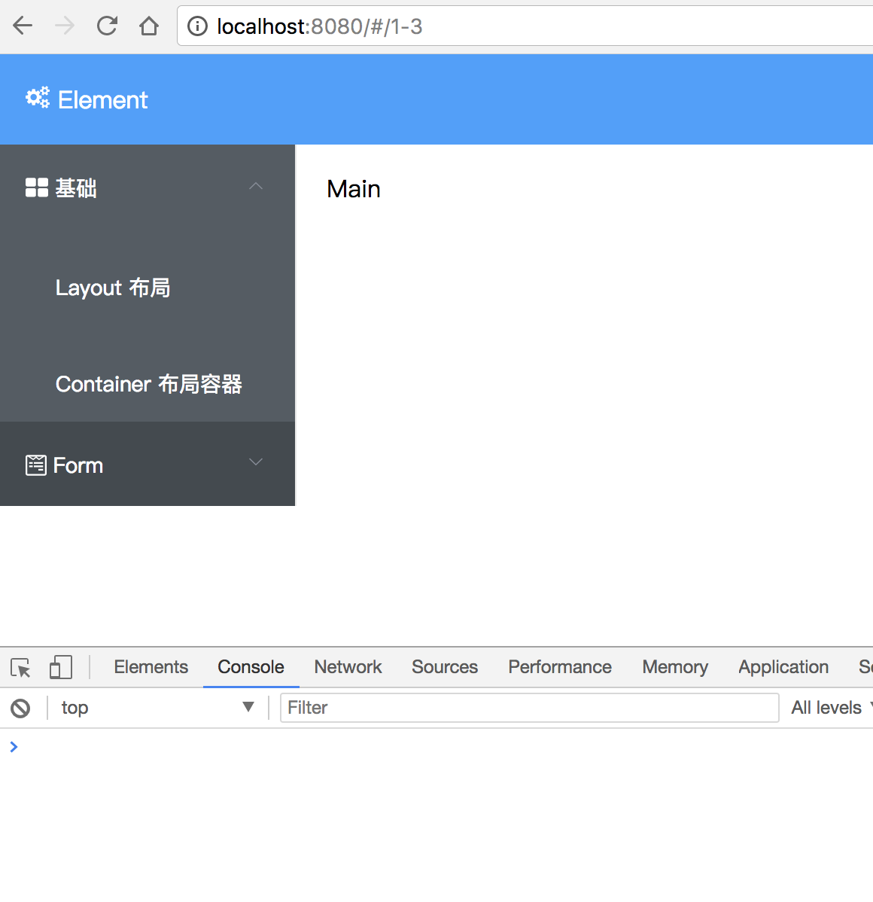

# 7 组件路由与懒加载
在components新增四个文件：

BasicContainer.vue
```
<template>
  <div>
    这是：Container 布局容器
  </div>
</template>
```

BasicLayout.vue
```
<template>
  <div>
    这是：Layout 布局
  </div>
</template>
```

FormCheckbox.vue
```
<template>
  <div>
    这是：Checkbox 多选框
  </div>
</template>
```

FormRadio.vue
```
<template>
  <div>
    这是：Radio 单选框
  </div>
</template>
```

修改route/index.js文件, 关于路由和懒加载就不在此赘述，任何文档都没有官方文档说的好。

`注意：如果您使用的是 Babel，你将需要添加 syntax-dynamic-import 插件，才能使 Babel 可以正确地解析语法。`
也就是说，你要先安装`syntax-dynamic-import`, 不然懒加载根本不行。
```
cnpm install --save-dev babel-plugin-syntax-dynamic-import
```

```
import Vue from 'vue'
import Router from 'vue-router'
import menus from '@/config/menu-config'

Vue.use(Router)

var routes = []

menus.forEach((item) => {
  item.sub.forEach((sub) => {
    routes.push({
      path: `/${sub.componentName}`,
      name: sub.componentName,
      component: () => import(`@/components/${sub.componentName}`)
    })
  })
})

export default new Router({ routes })
```

另外App.vue文件需要加上 router-view
```
<el-main>
  <router-view></router-view>
</el-main>
```

看看效果：点击菜单，路径跳转，并且每次都是单独去加载路由的文件。

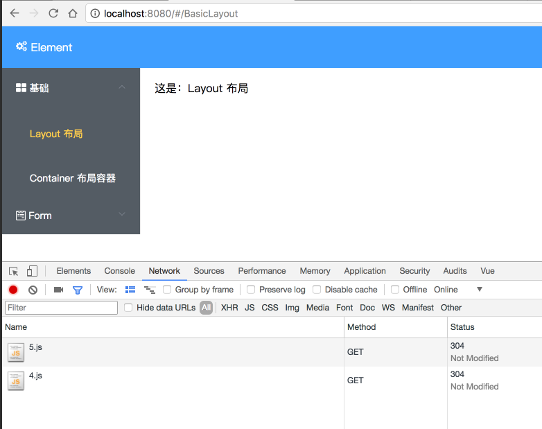

# 8 github 部署
如果你想在github上部署，那么你要修改config/index.js的以下代码, 不然有些文件因为路径问题可能会找不到。

```
 build: {
    // Template for index.html
    index: path.resolve(__dirname, '../docs/index.html'),

    // Paths
    assetsRoot: path.resolve(__dirname, '../docs'),
    assetsSubDirectory: 'static',
    assetsPublicPath: '/vue-el-dashboard/',
```